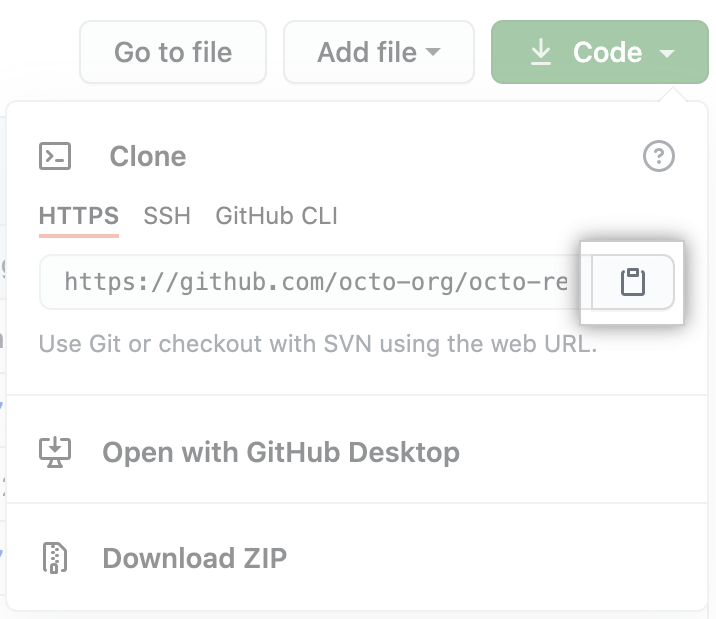

# Project NerdyGadgets
Voordat je begint met het project, lees je eerst de volgende informatie goed door.
Dit bestand beschrijft hoe je code aan dit project kunt toevoegen, en hoe de code is opgebouwd.

## Het toevoegen van code

### Stap 1 - Het maken van een fork

Begin met het maken van een fork van deze repository. Dit kan je doen met de fork knop rechtsboven op de pagina.

Let op dat je jezelf selecteert als eigenaar van de repository. Dit doe je door je eigen naam te selecteren in het dropdown menu.
De meeste opties op deze pagina kun je negeren, als je klaar bent klik je op de knop "Create Fork" onderaan de pagina.

### Stap 2 - Het klonen van de repository

Nu je een fork hebt gemaakt, moet je deze klonen naar je eigen computer. 
Navigeer naar je github profiel en vanaf daar naar je eigen repositories.
Nadat je de repository hebt gevonden, klik je op de knop "Code" en kopieer je de link die er bij HTTPS staat.
 \
 \
Open nu je PHPStorm en klik in de bovenste balk op de knop Git, en daarna op "Clone".

In het menu dat nu opent, plak je de link die je hebt gekopieerd in het veld "URL".

Persoonlijk raad ik je aan dit project in je htdocs te plaatsen, zodat je het makkelijk kan testen.
Klik op de knop "Clone" en wacht tot de repository is gekloond.
Zodra dit gedaan is, kun je het project openen.

### Stap 3 - Het bijhouden van de fork

Nu je een fork hebt gemaakt, moet je ervoor zorgen dat je fork up-to-date blijft met de originele repository.
Dit doe je door de originele repository toe te voegen als een remote repository.
Dit doe je door in de bovenste balk op de knop Git te klikken, en daarna op "Remote".

In het menu dat nu opent, klik je op het plusje linksboven.

In het menu dat nu opent, vul je de volgende gegevens in:
- Name: upstream
- URL: het url die je hebt gekopieerd in stap 2. 

Dat ziet er ongeveer zo uit:

Ik heb een compleet andere url gebruikt, maar dat maakt niet uit. Klik nu op OK.
Nu je dit hebt gedaan, moet je ervoor zorgen dat je fork up-to-date blijft met de originele repository.

### Stap 4 - Het synchroniseren van de fork

Iedereen heeft nu zijn eigen versie van het project, maar we willen natuurlijk wel dat iedereen de laatste versie heeft.
Dit doen we door de originele repository te pullen, en deze vervolgens te pushen naar onze fork.
Dit doe je door in de bovenste balk op de knop Git te klikken, en daarna op "Pull".

## Code style