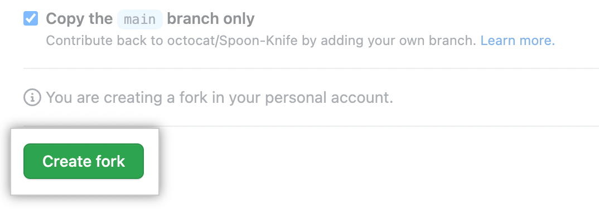
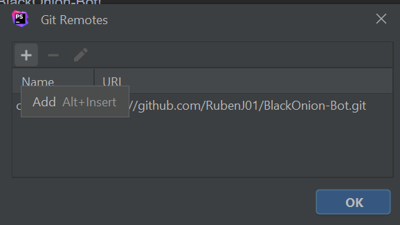
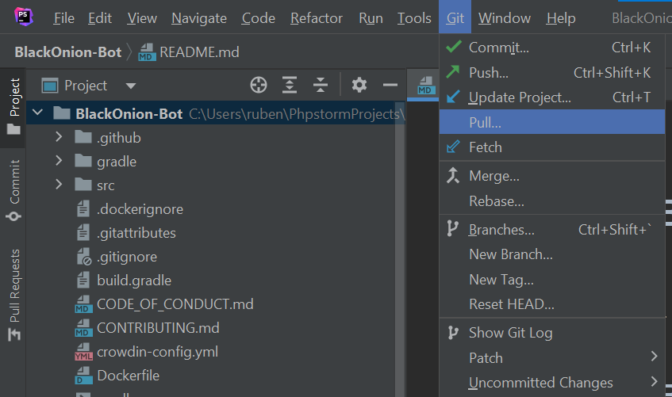

# Project NerdyGadgets
Voordat je begint met het project, lees je eerst de volgende informatie goed door.
Dit bestand beschrijft hoe je code aan dit project kunt toevoegen, en hoe de code is opgebouwd.

Dit project is beheerd door: Ruben, Thimo, Joëlle, Elias

## Het toevoegen van code

### Stap 1 - Het maken van een fork

Begin met het maken van een fork van deze repository. Dit kan je doen met de fork knop rechtsboven op de pagina.

Let op dat je jezelf selecteert als eigenaar van de repository. Dit doe je door je eigen naam te selecteren in het dropdown menu.
De meeste opties op deze pagina kun je negeren, als je klaar bent klik je op de knop "Create Fork" onderaan de pagina.


### Stap 2 - Het klonen van de repository

Nu je een fork hebt gemaakt, moet je deze klonen naar je eigen computer. 
Navigeer naar je github profiel en vanaf daar naar je eigen repositories.
Nadat je de repository hebt gevonden, klik je op de knop "Code" en kopieer je de link die er bij HTTPS staat.
Zorg ervoor dat je je eigen fork cloned, en niet mijn repository.
 \
 \
Open nu je PHPStorm en klik in de bovenste balk op de knop Git, en daarna op "Clone". (Mocht je deze optie niet hebben, 
klik dan op de knop "VCS" en selecteer "Get from Version Control", dit is hetzelfde als de optie "Clone" die je net hebt gemist.)

In het menu dat nu opent, plak je de link die je hebt gekopieerd in het veld "URL".

Persoonlijk raad ik je aan dit project in je htdocs te plaatsen, zodat je het makkelijk kan testen.
Klik op de knop "Clone" en wacht tot de repository is gekloond.
Zodra dit gedaan is, kun je het project openen.

### Stap 3 - Het bijhouden van de fork

Nu je een fork hebt gemaakt, moet je ervoor zorgen dat je fork up-to-date blijft met de originele repository.
Dit doe je door de originele repository toe te voegen als een remote repository.
Dit doe je door in de bovenste balk op de knop Git te klikken, en daarna op "Remote".


In het menu dat nu opent, klik je op het plusje linksboven.

 

In het menu dat nu opent, vul je de volgende gegevens in:
- Name: upstream 
- URL: het url van de originele repository. Dit is: https://github.com/RubenJ01/NerdyGadgets.git

Dat ziet er ongeveer zo uit: 

 

Ik heb een compleet andere url gebruikt, maar dat maakt niet uit. Klik nu op OK.
Nu je dit hebt gedaan, moet je ervoor zorgen dat je fork up-to-date blijft met de originele repository.

### Stap 4 - Het synchroniseren van de fork

Iedereen heeft nu zijn eigen versie van het project, maar we willen natuurlijk wel dat iedereen de laatste versie heeft.
Dit doen we door de originele repository te pullen, en deze vervolgens te pushen naar onze fork.
Dit doe je door in de bovenste balk op de knop Git te klikken, en daarna op "Pull".

 

In het menu dat nu opent, klik je op de knop "Pull from" en selecteer je "upstream".

 

Klik nu op Pull en wacht tot de originele repository is gepulled. Als dit niet lukt, stuur mij dan een berichtje op discord.
Volg deze stap elke keer uit voordat je begint met werken aan het project.

### Stap 5 - Het toevoegen van code

Nu kunnen we beginnen met het toevoegen van code.
Begin met het schrijven van je code, en zorg ervoor dat je de code goed test.
Zodra je klaar bent met het schrijven van je code, moet je ervoor zorgen dat je code wordt gepushed naar je fork.
Dit doe je door in de bovenste balk op de knop Git te klikken, en daarna op "Commit".


In het menu dat nu opent, selecteer je de bestanden die je wilt committen, 
maar meestal staan alle gewijzigde bestanden al geselecteerd. Vul nu een zinnige commit message in die beschrijfd welke
wijzigingen je hebt gemaakt.


Klik nu op de knop "Commit and Push" en in het menu dat nu opent, klik je op de knop "Push".


Nu is als het goed is je code gepushed naar je fork. (Zo niet stuur mij dan een berichtje op discord)

### Stap 6 - Het maken van een pull request

Nu je code is gepushed naar je fork, moet je ervoor zorgen dat je code wordt toegevoegd aan de originele repository.
Dit doe je door een pull request te maken. Dit doe je door naar je fork te navigeren op github, en vervolgens op de knop "Contribute" te klikken.


Klik nu op de knop "Open pull request". Op deze pagina kun je de wijzigingen zien die je hebt gemaakt, en kun je een titel en beschrijving toevoegen.
Zodra je klaar bent, klik je op de knop "Create pull request".


Nu is je pull request aangemaakt, en moet je wachten tot iemand jou wijzigingen heeft goedgekeurd.

## Code style

### Type Hinting

Type hinting is een manier om het type van een variabele te specificeren. Dit is handig omdat je dan weet wat voor type je kunt verwachten.
Type hinting is niet verplicht, maar wordt wel aangeraden. 
Neem de volgende simpele functie:

```php
function add($a, $b) {
    return $a + $b;
}
```

Deze functie heeft geen type hinting, maar je kunt wel zien dat de functie twee parameters verwacht, en dat de functie een integer teruggeeft.
Zodra je begint met het schrijven van grotere functies, wordt het lastiger om te zien wat voor type je kunt verwachten.
Dit is waar type hinting om de hoek komt kijken. De functie hieronder is hetzelfde als de functie hierboven, maar met type hinting.

```php
function add(int $a, int $b): int {
    return $a + $b;
}
```

Nu is het duidelijk dat de functie twee integers verwacht, en dat de functie een integer teruggeeft.

### PHPDoc

PHPDoc is een manier om de functie te documenteren. Dit is handig omdat je dan weet wat de functie doet, en wat de functie verwacht.
PHPDoc is niet verplicht, maar wordt wel aangeraden.
Neem de volgende simpele functie:

```php
function add(int $a, int $b): int {
    return $a + $b;
}
```

Naast type hinting is het ook handig om te weten wat de functie doet. Dit kun je doen door PHPDoc te gebruiken.
De functie hieronder is hetzelfde als de functie hierboven, maar met PHPDoc.

```php
/**
 * Adds two integers together
 * @param int $a
 * @param int $b
 * @return int
 */
function add(int $a, int $b): int {
    return $a + $b;
}
```

Net zoals type hinting is dit niet zo nuttig bij kleine functies, maar bij grotere functies kun je makkelijk zien
wat de functie doet, en wat de functie verwacht.

